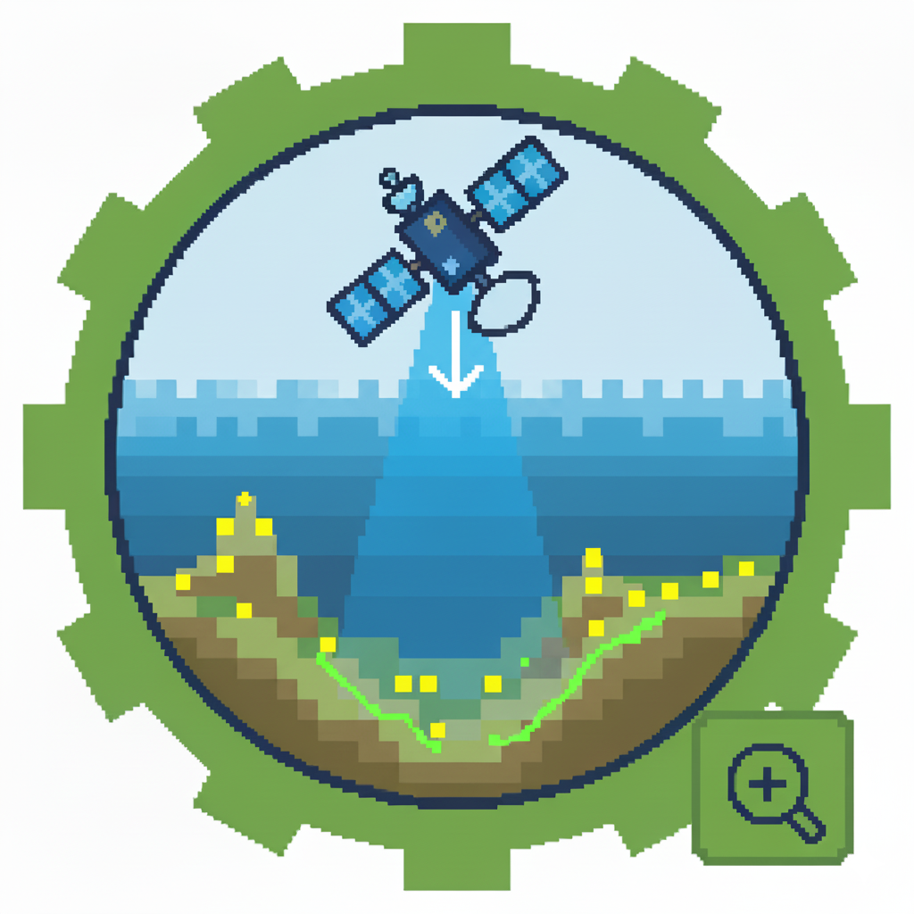

<table>
<tr>
<td>



</td>
<td>

**Bathymetrix-AI: Advanced SDB Toolkit**

</td>
</tr>
</table>


> **Note:** Bathymetrix-AI supports any satellite imagery provided that the imagery is atmospherically corrected (Surface Reflectance) and the raster values are stored as Float.

**Bathymetrix-AI** is a professional QGIS research toolkit for high-precision Satellite-Derived Bathymetry (SDB).

The toolkit integrates multispectral satellite imagery with ICESat-2 (ATL24) LiDAR bathymetry through a modular and adaptive Machine Learning framework. It is designed to automate the main SDB processing steps while maintaining control over data quality, model selection, spatial refinement, uncertainty, and scientific validation.

At the core of Bathymetrix-AI is the **SDB Single Masterflow** — the standard end-to-end workflow for producing a bathymetric map from a single satellite scene.

The toolkit also provides advanced Masterflows and standalone modules for more complex situations, including:
- **SDB SpatioSpectral Masterflow** — for evaluating and combining multiple satellite scenes of the same area.
- **SDB SpatioTemporal Masterflow** — for multi-year SDB modeling using time as part of the learning process.
- **Coastal Dynamics Analysis** — for analyzing bathymetric change, seabed stability, erosion, accretion, and shoreline dynamics.
- **ICESat-2 Downloader** — for acquiring and preparing ICESat-2 bathymetry data.
- **Tidal Datum Converter** — for converting bathymetric observations between tidal reference systems.

---

### 🆕 What's New in Version 7.4 (Changelog)

* 🎯 **Advanced Model Selection & Winner Stability (Monte Carlo Sensitivity):**
  * Introduced **7 specialized selection strategies** to govern algorithm choice during Phase 03/04:
    * `0. Winner Stability (Monte Carlo Sensitivity)`: Tests candidate models across $N$ simulation rounds with stochastic weight variations ($\pm 20\%$ default) to select the most noise-resilient regressor.
    * `1. SDB Composite Score`: Deterministic multi-metric weighting.
    * `2. Highest R²`, `3. Lowest RMSE`, `4. Lowest wMAPE`, `5. Lowest |Bias|`, and `6. Lowest MAE`.
  * **Auto-Balanced Weighting & Custom Syntax**: Selecting metric checkboxes automatically rebalances weights to sum to $1.0$, with support for custom syntax configuration (e.g. `R2: 70, RMSE: 30, Rounds: 50, Variation: +/-25%`).
* 🌊 **Automated Hydrodynamic Tidal Datum Engine (NASA GSFC GOT4.10c):**
  * Integrated automated remote retrieval, extraction, and constituent grid caching for the **NASA GSFC GOT4.10c** global ocean tide model.
  * Provides seamless offline hydrodynamic transformations between geodetic and tidal reference datums ($WGS84 \leftrightarrow MSL \leftrightarrow LAT \leftrightarrow CD$).
* 🔗 **Interactive Clickable Log Navigation & Unified Symbology:**
  * Standardized all execution summaries and completion banners with clickable `file:///` URLs, enabling instant access to output directories, generated GeoTIFF rasters, and HTML dashboards directly from the QGIS log panel.

---

### 📦 Previous Release Notes (Version 7.2)

* 📊 **Physics-Driven Feature Engineering (Bias Error Elimination):**
  * Introduced separate manual selection for **`[All Raw Bands]`** (Raw Reflectance / DN) vs. **`[All Log Bands]`** ($\ln(10000 \cdot R + 1)$).
  * **Radiative Transfer Linearization**: According to Beer-Lambert's law of optical attenuation ($L(\lambda) = L_\infty + C_b \cdot e^{-2K z}$), water depth scales logarithmically with subsurface reflectance. Training ML regressors on raw exponential signals induces severe non-linear compression and systematic depth bias in intermediate/deeper waters ($5\text{--}15\text{ m}$). Applying Log-transform linearizes the feature space, reducing mean depth bias to **$+0.0157\text{ m}$ (near-zero bias)** and preventing volumetric distortion in sediment calculations.
  * **Zero-Bias Defaults**: `[All Raw Bands]` is excluded from default feature stacks to protect against bias drift, while remaining available for specialized shallow-water micro-topography ($0\text{--}5\text{ m}$).
* 🌊 **Multi-Otsu / GMM 3D Spectral Clustering Recommended:**
  * Updated `Multi-Otsu / GMM Spectral Clustering [Recommended]` as the primary default OSW filter across all Masterflows and Preprocessing tools, isolating shallow water from optically deep water in 3D color space.
* 🎯 **Dual Target ROI Modes in Coastal Dynamics (Module 05/06):**
  * Added `🎯 [1.2] Target ROI Processing Mode` dropdown:
    * **`Clip Full Analysis to ROI (Crop Rasters & Vectors)`**: For strictly localized coastal engineering studies, cropping all rasters (MSI, StatCD) and shoreline migration vectors to the polygon boundary.
    * **`Calculate Sub-Region Quantities Only (Preserve Full Rasters)` [Default]**: Preserves the complete, unclipped spatial extent across the entire satellite scene for all output maps, while extracting exact accretion ($+m^3$), erosion ($-m^3$), and net sediment balance ($m^3$) exclusively inside the Target ROI polygon for QC/budgeting.
* 🎨 **Thread-Safe Layer Loading & QGIS Post-Processing Symbology:**
  * Replaced unsafe background thread GUI calls with `context.addLayerToLoadOnCompletion` and `StylePostProcessor(QgsProcessingLayerPostProcessorInterface)` to prevent access violation crashes while guaranteeing that thematic symbology (Red/Green Shorelines, MSI Spectral Ramps, Volumetric Diverging Ramps) loads automatically and vibrantly into QGIS.

---

### 📦 Previous Release Notes (Version 7.1)

* 🌟 **Advanced Multi-Method OSW Engine:** Replaced rigid single-percentile cutoff with an adaptive multi-method Optically Shallow Water (OSW) filtering engine featuring:
  * **`0. Automated Knee-Point Extinction [Recommended]`**: Automatic, physics-based inflection detection calculating the true optical extinction threshold on water absorption curves without manual guesswork.
  * **`1. Turbidity-Invariant Log-Ratio Extinction`**: Integrates the NDTI (Normalized Difference Turbidity Index) with Stumpf log-ratio stabilization to protect coastal waters from estuarine mud plumes and suspended sediment.
  * **`2. Multi-Otsu / GMM Spectral Clustering`**: 3D unsupervised color-space clustering separating deep ocean, transitional depths, and shallow lagoons in complex coral reef and heterogeneous benthic environments.
  * **`3. Automatic (NIR Percentile Fallback)`**: Legacy manual tuning option (e.g., 5% to 15%).
  * **`4. Manual Polygon ROI` & `5. Custom OSW Polygon`**: Full manual control via deep-water calibration samples or direct vector boundaries.
* 🏝️ **Connected-Component Topological Cleaning:** Integrated morphological island and connected-component sieving to eliminate small isolated wave/glint artifacts in the open ocean while preserving nearshore reefs and islands.
* 🔄 **Full Pipeline Synchronization:** Seamlessly unified the updated OSW engine across **Module 01 (Preprocessing)**, **SDB Single Masterflow**, **SDB SpatioSpectral Masterflow**, and **SDB SpatioTemporal Masterflow**.
* 📖 **Best Practice Workflow Guidance:** Added comprehensive documentation guiding users to test and benchmark preprocessing and OSW methods on their specific satellite scene before running full Masterflows.

---

### 🔬 Scientific Methodology — Core 5-Phase Workflow

The **SDB Single Masterflow** provides the core processing architecture of Bathymetrix-AI.
It organizes the complete SDB process into five connected phases:

**Phase 01 → Phase 02 → Phase 03 → Phase 04 → Phase 05**

Each phase has a specific role, from preparing the satellite data and cleaning the training observations to building the AI model, refining the spatial prediction, and scientifically validating the final result.


#### Phase 01: Advanced Pre-processing
The first phase prepares the satellite imagery for bathymetric modeling by isolating the aquatic domain, reducing radiometric interference, and generating depth-sensitive spectral features.
- **Sun-Glint Removal:** Reduces surface reflection effects to improve the visibility of the seabed signal using the Hedley approach (Hedley et al., 2005). The implementation also handles infinite and NaN values to improve processing stability.
- **Water Segmentation:** Identifies the aquatic domain using NDWI, MNDWI, and NWI together with adaptive thresholding.
- **Deep Water OSW Filtering:** Removes deep-water areas that are unsuitable for optically derived bathymetry using the new multi-method engine (Automated Knee-Point Extinction, Turbidity-Invariant Log-Ratio Extinction, Multi-Otsu/GMM 3D Spectral Clustering, and Connected-Component Topological cleaning).
- **OSW Boundary Extraction:** Automatically generates the Optically Shallow Water boundary as a GeoPackage vector while preserving the CRS of the source imagery.
- **Log-Ratio Features & Indices:** Transforms spectral information into bathymetry-sensitive features based on light attenuation principles. This includes physics-based Log-Ratio features such as Blue/Green, together with additional spectral indices.

#### Phase 02: Robust Filtering
This phase focuses on improving the quality of the training dataset before machine-learning modeling.
The workflow identifies unreliable observations, outliers, and environmental noise in the depth measurements.
- **Noise Removal:** Iteratively identifies high-confidence depth observations using methods such as:
  - Linear RANSAC
  - LS Variance Fit
  - Huber Variance Fit
- **Dynamic Diagnostic Plotting:** Generates readable diagnostic plots using robust percentile-based visualization so that extreme noise does not dominate the displayed variance and trend patterns.

*The objective of Phase 02 is simple: Better training data → More reliable AI modeling.*

#### Phase 03: Global Auto-ML & Feature Analysis
This is the main machine-learning stage of the workflow.
Instead of relying on a single predefined algorithm, Bathymetrix-AI automatically evaluates multiple models and determines which approach is most suitable for the available dataset.
- **Feature Analysis:** Identifies weak, redundant, or highly correlated features using Pearson correlation, Spearman correlation, and automated selection approaches such as Automatic-RANSAC and Automatic-Random Forest.
- **Algorithm Benchmarking:** Evaluates more than 15 machine-learning algorithms, including models such as Random Forest, Gradient Boosting, XGBoost, CatBoost, SVR, MLP, and other supported regressors.
- **Model Selection & Winner Stability:** Evaluates models using 7 distinct selection strategies (Winner Stability via Monte Carlo Sensitivity Simulation, SDB Composite Score, Max R², Min RMSE, Min wMAPE, Min |Bias|, Min MAE) with auto-balanced metric weighting and custom syntax parsing.
- **Hyperparameter Optimization:** Automatically searches for suitable model parameters using Random Search, Grid Search, or Bayesian Optimization.
- **Spatial Cross-Validation:** Provides independent spatial block cross-validation to evaluate model performance while reducing the risk of overly optimistic results caused by spatial dependence.
- **Ensemble Blending:** Supports multiple prediction-combination strategies, including Standard Average, Median, Stacking, and **Uncertainty-Weighted Pixel Fusion**. The Uncertainty-Weighted approach gives greater influence to predictions with lower estimated residual uncertainty.
- **Memory-Efficient Prediction:** Large rasters are processed in chunks to reduce memory usage and avoid crashes during prediction.
- **Customization:** Advanced users can control model parameters and optimization settings for detailed experimentation and research.

*The output of Phase 03 is the initial global bathymetric prediction.*

#### Phase 04: Adaptive Refinement
Global machine-learning models can perform well overall while still missing small-scale spatial patterns. Phase 04 is designed to address these remaining local errors.
The workflow analyzes the difference between predicted and observed depths and uses the spatial structure of the residuals to improve the final bathymetric surface.
- **Zero-Mean Centered Spatial Residuals:** Uses robust residual processing and spatial weighting approaches to reduce local depth bias.
- **Spatial Residual Modeling:** Supports spatial correction approaches including robust KNN and other supported residual-modeling methods.
- **Spatial Cross-Validation:** Provides independent spatial validation for the residual model.
- **Adaptive Re-training & Pixel Fusion:** Combines the available model information with spatial error information to produce a refined bathymetric map.
- **IHO Standards Assessment:** The workflow can evaluate the resulting accuracy against applicable IHO Order 1a/2 Total Vertical Uncertainty (TVU) criteria.

*The main purpose of Phase 04 is: Global prediction → Local error analysis → Spatial refinement → Improved final SDB.*

#### Phase 05: Validation & Reporting
The final phase evaluates the complete SDB result using independent validation information when available.
- **Independent Accuracy Assessment:** The final model can be tested against unseen validation points to provide an independent assessment of predictive performance. Typical metrics include **R²** (Coefficient of Determination), **RMSE** (Root Mean Square Error), and **wMAPE** (Weighted Mean Absolute Percentage Error). The workflow can also evaluate compliance with relevant IHO Order 1a/2 TVU criteria.
- **Interactive Validation Dashboard:** The system generates a structured HTML dashboard containing model leaderboards, validation metrics, diagnostic plots, and summary information.

*The final objective is not only to generate a depth map, but also to provide a measurable and traceable assessment of its quality.*

---

### From Core Workflow to Advanced Analysis
The SDB Single Masterflow is the foundation of the Bathymetrix-AI processing architecture.
When the project becomes more complex, the toolkit provides additional workflows designed for specific objectives:
- **One satellite scene** → SDB Single Masterflow
- **Multiple scenes of the same area** → SDB SpatioSpectral Masterflow
- **Multiple years** → SDB SpatioTemporal Masterflow
- **Yearly SDB maps** → Coastal Dynamics Analysis

This structure allows Bathymetrix-AI to progress from single-scene bathymetric mapping to multi-scene optimization, and finally to multi-year bathymetric and coastal change analysis.

The detailed descriptions of these advanced Masterflows and standalone modules are provided in the sections below.

🚀 **Masterflows & Standalone Modules**

### 1️⃣ SDB Single Masterflow
What if you could turn a satellite image into a bathymetric map without manually choosing algorithms, tuning dozens of parameters, or building the workflow step by step? That is the idea behind the **SDB Single Masterflow**.

I designed the Single Masterflow as a complete end-to-end workflow for **Satellite-Derived Bathymetry (SDB)** from a single satellite scene. Instead of running separate tools one by one, the Masterflow organizes the complete process into a single workflow:
**Pre-processing → Data Filtering → AI Modeling → Adaptive Refinement → Scientific Validation**

<p align="center">
  
</p>

#### What does it actually do?
- First, the satellite image is prepared for SDB. The workflow performs the required preprocessing, including atmospheric and water-related preparation, sun-glint correction, water masking, and spectral feature extraction.
- Then, the training data are examined and filtered to reduce the influence of unreliable or abnormal observations.
- After that comes the AI modeling stage. The workflow can evaluate multiple machine-learning algorithms and identify the model that performs best for the available dataset.
- But the process does not stop at producing a raw prediction. The resulting SDB is passed through an **Adaptive Refinement** stage, where spatial residual patterns can be analyzed and corrected to improve the final bathymetric surface.
- Finally, when independent validation data are available, the workflow evaluates the result using scientific performance metrics.

#### Why is this useful?
Traditional SDB processing can become a long chain of separate steps:
`Satellite image → preprocessing → masking → feature extraction → filtering → model training → prediction → correction → validation...`

For many users, the challenge is knowing **how they should be connected and how to keep the workflow consistent**. The Single Masterflow is designed to solve that problem. It provides a structured workflow where the processing stages are connected and executed as one complete SDB pipeline.

#### When should you use it?
The Single Masterflow is the right choice when you have:
- 📡 **One suitable satellite scene**
- 📍 **Training depth data**
- 🎯 **Optional independent validation data**

and your goal is to produce **one reliable SDB map for that scene**.

It is especially useful for standard SDB production, testing machine-learning models, processing a specific acquisition date, and establishing a consistent SDB workflow. Think of it as the **foundation of the Bathymetrix-AI Masterflows**.

---

### 2️⃣ SDB SpatioSpectral Masterflow
What if the problem is not your SDB model — but simply choosing the wrong satellite scene? A satellite image may look visually good, but that does not necessarily mean it will produce the best bathymetric result. Water clarity, sun-glint, waves, turbidity, atmospheric conditions, and other factors can strongly affect SDB performance.

That is why I developed the **SDB SpatioSpectral Masterflow**. Instead of asking the user: *“Which satellite image should I use?”*, the workflow asks: *“What can each available scene tell us about the bathymetry?”*

<p align="center">
  
</p>

#### How does it work?
The workflow starts with multiple satellite scenes covering the same area (e.g., Scene 1 + Scene 2 + Scene 3 + Scene 4). Each scene is processed **independently**.
- **Phase 1 (Pre-processing) & Phase 2 (Data Filtering)** are applied to each scene. The training data are evaluated for that specific scene, which is important because the same training point may behave differently from one image to another.
- **Phase 3 (AI Modeling)** models each scene independently using the available machine-learning algorithms. The result is a separate SDB map for each scene, together with its model performance and reliability information.

**Then comes the important part.** The system does **not simply merge all images together**. Instead, it compares the independent SDB results and allows different strategies to determine the most appropriate final representation:
- 🏆 **Select Best Scene:** Automatically choose the scene with the strongest model performance.
- 📊 **Weighted Mean:** Give stronger influence to scenes that produced more reliable results.
- 📐 **Weighted Median:** Use scene reliability while keeping the result more resistant to unusual or extreme predictions.
- 📈 **Median & Mean:** Use standard aggregations without assigning additional weights.

This means the workflow uses the **actual SDB performance of each scene** to help determine how the final bathymetry should be represented. Cloud percentage alone does not tell the whole story.

After aggregation, the resulting bathymetric map moves to **Phase 4 (Adaptive Refinement)** where remaining local spatial residual errors can be corrected. Finally, **Phase 5 (Scientific Validation)** evaluates the aggregated result and generates the same extensive **Interactive HTML Dashboards and detailed reports** as the Single Masterflow, ensuring strict **IHO S-44 Compliance**.

#### When should you use it?
Use it when:
- 📡 You have **multiple satellite scenes of the same area**
- ❓ You are **not sure which scene is best**
- 🤖 You want the system to **evaluate the scenes automatically**
- 🗺️ You want **one final bathymetric map** from multiple observations (for a single time period).

---

### 3️⃣ SDB SpatioTemporal Masterflow
What if an SDB map could do more than show the seabed — what if it could help explain how the seabed changes over time? While the Single Masterflow focuses on one satellite scene, and the SpatioSpectral Masterflow works with multiple scenes to produce one improved SDB map, the SpatioTemporal Masterflow is designed for a different question:

**How does bathymetry evolve through time?**

<p align="center">
  
</p>

#### How does it work?
Imagine having satellite imagery from 2019, 2021, 2023, and 2025. The goal is not simply to create four independent SDB maps. Instead, the workflow uses the information from all available years to build a **Global Spatiotemporal AI Model**.

For each year, the imagery is first processed independently through preprocessing and data filtering. Then the training information from the different years is combined into a global matrix containing: **Spectral Features + Depth + Year**.

The important difference is that **Year becomes a feature inside the AI model**. This allows the model to learn from the relationship between spectral information, depth, and time, rather than treating every year as a completely isolated problem. The global model can then generate consistent maps for each year (SDB 2019, 2021, 2023, 2025). 

After that, Adaptive Refinement is performed separately for each year to address local spatial errors that may differ from one year to another. The result is a **consistent series of bathymetric maps through time**.

#### Coastal Dynamics Analysis (Module 06)
The yearly SDB maps become the input for the **Coastal Dynamics Analysis** tool. Instead of looking at each map separately, the tool analyzes the changes between years. It investigates:
- **Long-term bathymetric trends & Net bathymetric change**
- **Morphological Stability Index (MSI)** (computes the volatility and stability of the seabed based on temporal depth variance).
- **Erosion and accretion & Shoreline movement**
- **Volumetric Sand Tracking & Target ROI Analytics:** Utilizes robust Linear Regression to track sediment volume (m³).

The system can also apply a dynamic noise threshold (Statistical Level of Detection - StatCD) so that very small apparent changes are not automatically interpreted as real seabed change.

#### Why is this important?
A single SDB map tells us: *"What is the seabed like?"*
Multiple SDB maps tell us: *"How has the seabed changed?"*

This creates a complete chain from satellite observations to temporal coastal interpretation:
**Multiple Years → Global Spatiotemporal AI → Yearly SDB Maps → Temporal Bathymetric Analysis → Morphological & Coastal Dynamics**

---

### 🛠️ Other Standalone Tools

**ICESat-2 Downloader**
A specialized standalone tool to query, filter, and download ICESat-2 (ATL24) LiDAR bathymetry data directly from NSIDC for integration into the MasterFlow pipeline.

**Tidal Datum Converter**
A dedicated standalone tool to seamlessly convert and correct bathymetric data across different tidal datums (e.g., Mean Sea Level to Chart Datum) integrating the NASA GSFC GOT4.10c automated global ocean tide model, ensuring accurate vertical alignment for precise charting and temporal comparisons.

📊 **Performance Metrics**

The tool evaluates results using three main standards:  
**R2** (Coefficient of Determination): Measures how well the model fits the data.  
**RMSE** (Root Mean Square Error): Measures the average vertical error in meters.  
**wMAPE** (Weighted Mean Absolute Percentage Error): Measures the relative error across different depth ranges.

🛠️ **Installation & Dependencies**  
Open **OSGeo4W Shell** (as Administrator) and run the following command to install all required libraries. This version is optimized for **QGIS 4.0 (Qt6)** and **NumPy 2.0** support:

```bash
pip install numpy pandas rasterio matplotlib seaborn scikit-learn>=1.5.0 scipy joblib scikit-optimize sliderule icepyx geopandas parquet netCDF4 xgboost lightgbm catboost optuna
```

📧 ***Contact & Citations***

**Author:** Mohamed Aly Nasef  
**Email:** Eng.m.nasef2017@gmail.com, Nasefm.aly@alexu.edu.eg  


🤖 **AI Acknowledgment**  
The development of the Bathymetrix-AI code, its logical structure, and the technical documentation were significantly enhanced and optimized using Google Gemini. The AI assisted in debugging complex workflows and ensuring the implementation follows best practices in data science.
